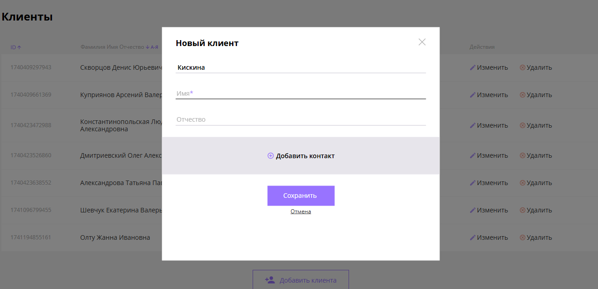
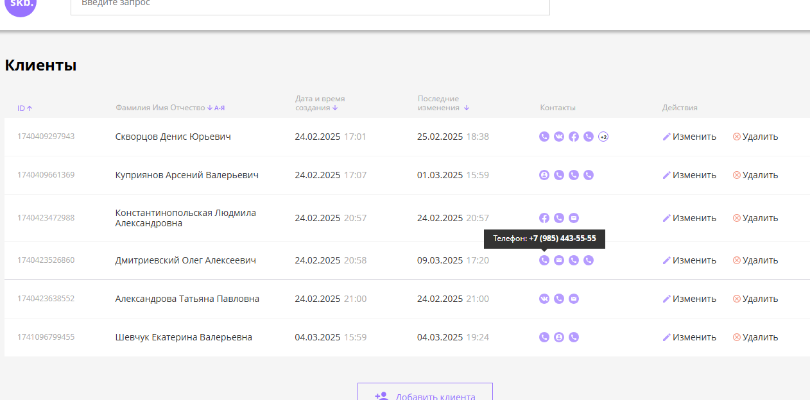
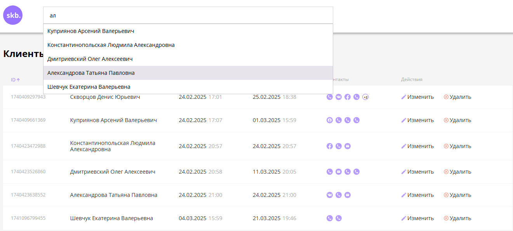

# Frontend Pro

## Description

This project represents the main repository, which includes the `crm-backend` folder and the `frontend-module` submodule. The main repository contains the overall project structure and installation and usage instructions.

### Frontend Module

This project represents the frontend part of the application with the following functionality:
- User authentication and authorization
- Form validation before submitting to the server
- Dashboard with real-time data visualization
- Data editing
- Data sorting and searching
- Autocomplete functionality in the filter input
- Integration with backend API for data fetching and manipulation
- Responsive design for mobile and desktop
- Modal window animations
- Loading indicators
- Hash and hashchange functionality
- BEM (Block Element Modifier) methodology for CSS class naming

### CRM Backend

The `crm-backend` folder contains the server-side part of the application, which allows working with data through the API. The rights to `crm-backend` belong to Skillbox.

#### New Functionality

- Added server functionality for autocomplete and hash-based URL handling:
  - `GET /api/clients/autocomplete?query={query}`: Get a list of client autocomplete suggestions based on the query. Parameters passed in the URL:
    * `query={query}`: A string to search for clients by first name, last name, or middle name.
  - `GET /#client_id`: Get a client by their ID from the hash part of the URL. Example:
    ```plaintext
    GET /#12345
    ```
    This method returns an HTML file with the edit client modal window open.

## Course Information

This project is the final work for the JavaScript "Basic Level" course at Skillbox.

## Installation

1. Clone the repository:
   ```sh
   git clone https://github.com/EkaterinaSevciuc/frontend-pro.git
   ```

2. Navigate to the project directory:
   ```sh
   cd frontend-pro
   ```

3. Initialize and update the submodule:
   ```sh
   git submodule update --init --recursive
   ```

### Setting up the CRM Backend

1. Navigate to the `crm-backend` directory:
   ```sh
   cd crm-backend
   ```

2. Install the dependencies:
   ```sh
   npm install
   ```

3. Start the server using npm:
   ```sh
   npm start
   ```

   Alternatively, you can start the server using Node.js directly:
   ```sh
   node index.js
   ```

## Usage

1. Open the `index.html` file in your browser.

## Examples

- Example 1: User login and registration
- Example 2: Viewing and interacting with the dashboard
- Example 3: Using autocomplete functionality in the filter input

## Screenshots

 



## Contributing

If you would like to contribute to this project, please follow these steps:
1. Fork the repository.
2. Create a new branch (`git checkout -b feature-branch`).
3. Make your changes and commit them (`git commit -m 'Add new feature'`).
4. Push to the branch (`git push origin feature-branch`).
5. Create a new Pull Request.

## License

This project is licensed under the [MIT License](LICENSE).